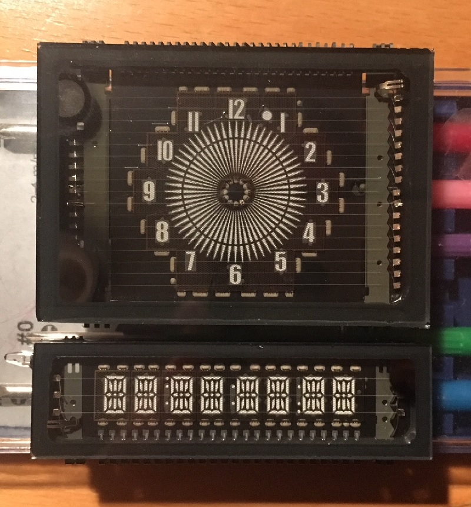

# Round Clock

**Work in progress. Not yet ready.**
**Do not produce PCB according to this project! This will not work.**

This is a KiCad project for building a clock using these two VFD displays:

* Radio controlled clock
* Clock face time display
* Additional 8x text display, allowing to show
    * Date
    * Temperature
* 5 buttons
* 5V operation

* The VFDs are driven by 2 PT6315
* The clock is controlled by an Atmega328P
* Time signal will be received from DCF-77 by the Pollin DCF-1 receiver
* There is a USB-to-serial port using CH340G
    * For an Arduino-like programming interface
    * For optional control of the clock via PC
* Battery backed clock
* FRAM for saving settings

